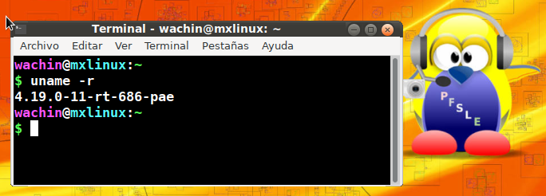
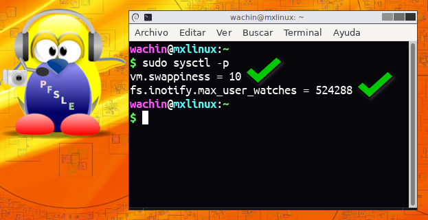
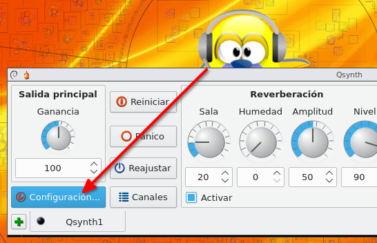
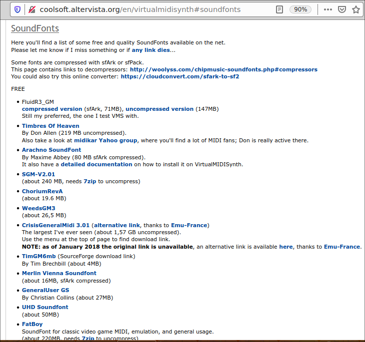

Antes de continuar les digo que para mi un Kernel es como las llantas de
un auto, uno las puede cambiar por otras las cuales pueden tener otro
labrado tal vez para otro terreno, pero primero hay que apagar el auto,
así mismo es con el Kernel, el que vamos a usar ha sido creado para un
propósito especial.

¿Por qué hice este tutorial?
----------------------------

Porque cada vez escasea más software para 32 bits. Por cierto a esta
fecha 2024 en AV Linux no veo que tenga una versión de 32 bits como
antes la tenían:

<https://www.bandshed.net/>

Y también lo hago porque si ustedes usen un Linux en particular y no
quieran usar AV Linux o [Ubuntu
Studio](https://ubuntustudio.org/) podrán aprender aquí como configurar
su Sistema Operativo Linux para que funcione igual

Para usar en un sistema operativo bajas latencias o lo que también lo
puedo explicar con mis palabras, es decir que no haya retardo -mínimo-
en el audio que se escucha desde un micrófono hasta los parlantes de un
ordenador u otro dispositivo conectado, necesitamos usar un Kernel
especial llamado  Kernel Realtime, en contraste en AV Linux o
UbuntuStudio ya viene todo configurado, y esas mismas configuraciones
las vamos a aprender a usar. Este tutorial es para Sistemas badados en
Debian o Ubuntu, pero lo podrían adaptar para otro viendo los nombres de
los paquetes y otros.

### Probado en

Este tutorial ha sido testeado en:\
\
- MX Linux 19 de 32 bit

\- antiX 19 de 32 bits\
\
- MX Linux 21 de 32 bits

Debería de funcionar en Sistemas Operativos basados
en [Debian](https://distrowatch.com/table.php?distribution=debian) como
son: [MX
Linux](https://distrowatch.com/table.php?distribution=mx), [Deepin](https://distrowatch.com/table.php?distribution=deepin), [antiX](https://distrowatch.com/table.php?distribution=antix), [Kali](https://distrowatch.com/table.php?distribution=kali), [Sparky](https://distrowatch.com/table.php?distribution=sparky), [Parrot](https://distrowatch.com/table.php?distribution=parrot), [Tails](https://distrowatch.com/table.php?distribution=tails), [Q4OS](https://distrowatch.com/table.php?distribution=q4os), [PureOS](https://distrowatch.com/table.php?distribution=pureos), [Voyager
Live](https://distrowatch.com/table.php?distribution=voyager), [Volumio](https://distrowatch.com/table.php?distribution=volumio), [Raspbian](https://distrowatch.com/table.php?distribution=raspbian), [Whonix](https://distrowatch.com/table.php?distribution=whonix), [Slax](https://distrowatch.com/table.php?distribution=slax), [SteamOS](https://distrowatch.com/table.php?distribution=steamos), [AV
Linux](https://distrowatch.com/table.php?distribution=avlinux),  [SolydXK](https://distrowatch.com/table.php?distribution=solydxk),  [Pardus](https://distrowatch.com/table.php?distribution=pardus), [Proxmox](https://distrowatch.com/table.php?distribution=proxmox), [Academic
GNU/Linux](https://distrowatch.com/table.php?distribution=academix), [Univention
Corporate
Server](https://distrowatch.com/table.php?distribution=univention), [Debian
Edu/Skolelinux](https://distrowatch.com/table.php?distribution=skolelinux), [Linux
Mint Debian Edition](https://linuxmint.com/download_lmde.php), etc,

### ¿Cómo instalaremos la baja latencia?

Aquí dejo dos opciones, la mejor para mi es usando el Kernel de AV
Linux, por el momento he hecho unas instrucciones de cómo compilarlo
(por el desarrollador original Trulan) y la segunda es usando un Kernel
RT de Debian

1er Opción - instalar el Kernel de AV Linux
-------------------------------------------

He hecho un manual de cómo compilarlo y esto eso es aplicable a 32 y 64
bits:

Compilando Kernel de AV Linux en MX Linux 19 de 32 bits (Trulan)\
<https://facilitarelsoftwarelibre.blogspot.com/2022/04/compilando-kernel-de-av-linux-en-mx.html>

Allí en el tutorial he podido crear los deb de un Kernel de 32 bit el
cual lo pueden descargar e instalar para usar, allí les explico en esa
entrada todo al respecto. Y con las instrucciones allí ustedes podrán
compilar uno de esos Kernel de AV Linux

También les quiero decir que viejo no significa obsoleto, esto en cuanto
al Kernel de AV Linux orginal hecho por Trulan el cual ya no está en
desarrollo, pero funciona de maravilla, solo que ya no tiene las
correcciones de seguridad para los errores de seguridad que se vayan
encontrando con el paso del tiempo en el Kernel de Linux; pero yo lo veo
así, si uno va a navegar en paginas seguras pues no tenemos nada de que
preocuparnos, excepto que alguien quiera navegar buscando cracks, o
parches de programas de Windows o paginas malas, allí si se expone a que
vulneren su seguridad usando el Kernel de AV Linux que hizo Trulan.

2da opción - Instalar el Kernel de Tiempo Real de Debian o Ubuntu
-----------------------------------------------------------------

En Debian hay unos paquetes de Kernel llamados rt (Realtime = Tiempo
Real), un Kernel consta generalmente de dos partes, están en los
repositorios de la Distro pero si desean los pueden buscar así:

<https://packages.debian.org/search?keywords=linux-headers-rt>

<https://packages.debian.org/search?keywords=linux-image-rt>

los he probado y me funciona bien con \"Jack Audio Connection Kit
(JACK)\" (pero mejor funcionan los de AV Linux que hizo Trulan)

En los paquetes de Ubuntu online pueden encontrar los dos en el
siguiente link:

<https://packages.ubuntu.com/linux-lowlatency>

### Instalando el Kernel en Tiempo Real (Real Time) de los repositorios de Debian

Las siguientes instrucciones son para un Sistema Operativo basado en
Debian. Primero es necesario recargar los repositorios:

 

sudo apt-get update

 

luego instalar las actualizaciones si es que las hayan enviado:

 

sudo apt-get upgrade

Luego por un caso autoremove

Ponga en la terminal:

sudo apt-get autoremove

esto es para eliminar algún paquete viejo que esté por allí.

Nota: Los siguientes dos paquetes que tienen dentro del nombre: image y
headers son paquetes de configuración que instalan automáticamente el
último Kernel RT que esté disponible

### Instalar Kernel Realtime para 32 bits desde Debian repo

Si su ordenador usa 32 bits, poner en la terminal:

sudo apt-get install dkms linux-image-rt-686-pae
linux-headers-rt-686-pae

aquí pondré una captura de pantalla de la instalación en 32 bits:

{width="10.041666666666666in"
height="1.8854166666666667in"}

\
puede investigar sobre ellos también en linea en los paquetes de debian:

<https://packages.debian.org/linux-image-rt-686-pae>

<https://packages.debian.org/linux-headers-rt-686-pae>

### Instalar Kernel Realtime para 64 bits desde Debian repo

Si su ordenador usa 64 bits, poner en la terminal:

sudo apt-get install dkms linux-image-rt-amd64 linux-headers-rt-amd64

puede ver información de esos paquetes aquí:

<https://packages.debian.org/linux-image-rt-amd64>

<https://packages.debian.org/linux-headers-rt-amd64>

#### Instalando los paquetes del Kernel Real Time desde Synaptic

También si desea puede buscarlos uno por uno en Synaptic. Las siguientes
capturas de pantalla son de MX Linux 21 de 32 bit:

linux-image-rt-686-pae

{width="8.104166666666666in"
height="5.979166666666667in"}

luego:

linux-headers-rt-686-pae

{width="7.072916666666667in" height="5.9375in"}

y:

dkms

{width="8.052083333333334in"
height="6.322916666666667in"}

la siguiente captura de pantalla es en synaptic viendo cómo se instala
el Kernel Real Time en MX Linux 21:

{width="7.729166666666667in"
height="7.041666666666667in"}

Se demora bastantito.

Instalando el Kernel Low Latency en una Distro basada en Ubuntu
---------------------------------------------------------------

### Esta parte es por si ustedes quisieran instalar el Kernel Low Latency de UbuntuStudio en alguna Distro basada en Ubuntu que no sea UbuntuStudio (las razones pueden ser que no les gustara como es UbuntuStudio). Por el momento lo siguiente no lo voy a a poder poner completo y no se si luego lo pueda hacer, pero dejo esta información porque en cualquiera de las Distros basadas en Ubuntu en los repositorios está el Kernel Low Latency el cual es el mismo que usa Ubuntu Studio, ejemplo he elejido el de focal:

### <https://packages.ubuntu.com/focal/linux-lowlatency>

{width="10.604166666666666in" height="6.625in"}

solo deben buscar en synaptic esos kernel e instalarlo, tambien hay unos
paquetes de ubuntustudio con todas las configuraciones solo de instalar,
se llaman:

ubuntustudio-default-settings

ubuntustudio-lowlatency-settings

Nota: Puede que falte alguno en esta lista, pero ustedes pueden buscar
en Google

lo pueden buscar entre la siguiente busqueda:

<https://packages.ubuntu.com/search?keywords=ubuntustudio>

### 

Instalar los paquetes para usar Jack Audio Connection Kit (JACK)
----------------------------------------------------------------

La siguietne lista de paquetes es para una Distro basada en Debian, no
se si todos funcionarán en alguna Distro basada en Ubuntu pero pueden
probar. Una vez instalado un Kernel de baja latencia, los siguientes son
los paquetes más usuales para usar con JACK, copie de una sola vez las
siguientes tres lineas y póngalas en la terminal:

sudo apt install ardour pulseaudio-module-jack qjackctl gedit \\

calf-plugins amb-plugins tap-plugins fluid-soundfont-gm \\

dssi-host-jack dssi-utils pavucontrol a2jmidid qsynth vmpk jack-keyboard

Nota: Instalaré Gedit pues es el editor de texto que más uso, pero usted
puede usar otro y cambiarlo en las instrucciones donde aparezca.

 y ejecútelas así:

{width="7.3125in" height="3.8020833333333335in"}

ponga su contraseña y espere a que se instale todo.

### Configuración de jackd2

Cuando empiece la instalación habrá un momento en que le aparecerá así:

{width="6.666666666666667in"
height="4.520833333333333in"}

póngale que si de acuerdo donde esté con las flechas del teclado y luego
de ENTER\
 

Ahora bien, si por un caso se confundió y aplastó ENTER en \"No\" y no
se configuró el sitema con RealTime pues vuelva a intentarlo, para eso
ponga en la terminal [este
comando](https://www.hispasonic.com/foros/jack-no-logra-cambiar-configuraciones-sonido/451988):

sudo dpkg-reconfigure -p high jackd2

y allí si ponga que Si.

 aunque también puede aparecerle así:

{width="8.322916666666666in"
height="6.635416666666667in"}

Nota: Antes aquí yo tenía una sección donde explicaba cómo hacer una
verificación del grupo de audio cuando se instala el Kernel en Tiempo
Real, pero la he quitado debido a que en los Sistemas Operativos Linux
eso ya viene configurado al hacer la instalación, pero lo he dejado como
consulta [aquí](https://facilitarelsoftwarelibre.blogspot.com/2024/03/verificando-el-grupo-audio-en-el-kernel-real-time.html).

Reiniciar y debe elegir el Kernel Real Time, aquí les dejo un video:

VIDEO:\
El siguiente es un video que hice de cómo elegí en el Grub al Kernel RT
al reiniciar el ordenador:

Nota: Si hacen esto en alguna distro basdada en Ubuntu deben elegir el
Kernel Low Latency en el grub  al reiniciar

Si por un caso no se vea sincronizado el audio con el video mejor abran
el video aparte:\
\
Eligiendo el Kernel Real Time en MX 19\
<https://youtu.be/kN_jFjBW21U>

### Posibles problemas (Solución instalar un Kernel antiguo y dejarlo seleccionado para iniciar, con grub-customizer)

No debería haber ningún problema, pero MX Linux como las demás
distribuciones también como Ubuntu, envian  frecuentemente nuevos
kernels, y si ustedes instalan alguno de los nuevos puede ser que alguno
de ellos le cause algún problema como por ejemplo lo que les explicaba
en el video que no me quería coger la Memoria SD. En ese caso puede usar
alguna de las versiones anteriores del Kernel que les funcionaba bien,
para ello pueden usar grub-customizer para elegir el Kernel que
necesiten

La siguietne captura de pantalla es después de instalr el Kernel Real
Time de los repositorios de Debian en MX Linux 21 visto en
Grub-Customizer

{width="9.375in" height="6.59375in"}

pero les cuento que ese Kernel 5.10.0-28 en el ordenador de escritorio
que armé con la tarjeta madre que me regaló mi primo Paco información de
la misma la cual se puede conocer poniendo en una terminal:

sudo dmidecode -t 2

y me da:

{width="4.239583333333333in"
height="3.3958333333333335in"}

con lo cual sé que es una:

ASUSTek Computer INC. LEONITE Version: 5.00 Serial Number:
MS1C6CS29109829

les cuento que a veces al encender el ordenador y en el grub al elegir
ese Kernel 5.10.0-28 a veces se cuelga y no se puede poner la contraseña
para entrar. Pero el otro Kernel 5.6 de AV Linux el que
yo [compilé](https://facilitarelsoftwarelibre.blogspot.com/2022/04/compilando-kernel-de-av-linux-en-mx.html) siempre
va bien, nunca se cuelga esta PC, será porque es muy muy vieja y es más
compatibole el Kernel 5.6, por tal motivo mejor pongo que se inicie el
Kernel de Trulan en Grub-ustomizer:

{width="6.25in" height="2.6354166666666665in"}

así cuando inicie no tendré que perder tiempo buscando al Kernel de
Trulan (Si fuera la primera vez que usted instala Grub-Customizer es
posible tenga que buscar en: \"Advanced options . . .\" el Kernel de
Trulan)

### ¿Cómo saber cuál Kernel estoy usando?

Ponga en la terminal:

uname -r

a mi me devuelve en el caso de estar usando el Kernel RT de los
repositorios de Debian:

{width="7.125in" height="2.5625in"}

para este tutorial usted ya debe estar usando el Kernel Real Time que
haya instalado.

### Verificar \"real-time priority\" y \"memlock\"

Para verificar si las aplicaciones del grupo audio tienen prioridad en
tiempo real  95 y si el [tamaño máximo que se puede bloquear en la
memoria es
infinito](https://stackoverflow.com/questions/974636/what-does-ulimit-l-mean),
esto significa que las [aplicaciones de audio tendrán prioridad en
tiempo real y pueden usar toda la memoria que
quieran](https://discourse.ardour.org/t/your-system-has-a-limit-to-locked-memory-solution/86813/4) con
prioridad sobre cualquier otra aplicación incluso si usted no se tiene
cuidado se podría congelar el sistema operativo si no tiene mucha
memoria el ordenador -hay que cuidad no tener aplicaciones innecesarias
abiertas en ordenadores que no tengan mucha memoria- ponga en la
terminal:

ulimit -r -l

debe darle un resultado como este:

{width="7.1875in" height="2.4895833333333335in"}

si les sale cero en \"real-time priority\" y si en \"max locked memory\"
no le aparece \"unlimited\" y les aparece algún número es que está mal
configurado, lo cual significaría que usted se equivocó en algún paso.

Checkeando la configuración de Audio en Tiempo Real
---------------------------------------------------

El siguiente es un programa creado
por [raboof](https://github.com/raboof) para ver si todo está
configurado bien para el audio en tiempo real:\
\
raboof/realtimeconfigquickscan: Linux configuration checker for systems
to be used for real-time audio\
<https://github.com/raboof/realtimeconfigquickscan>\
\
se llama realtimeconfigquickscan, para instalarlo primero necesitamos
instalar la siguiente dependencia:

sudo apt install perl-tk

Nota: Es posible que les pida instalar algo más, eso se vería en la
terminal en algún mensaje de error y allí tendrían que copiar partes de
lo que dice y buscar en Google la solución del paquete que faltaría
(espero no pase, aunque no creo que eso pase)\
\
\
realtimeconfigquickscan en AV Linux (AVL-MXE)\
La siguiente es una captura de pantalla que hice en el Sistema Operativo
AV Linux MXE del 2020 de la verificación de las configuraciones Real
Time en el Sistema, allí el sistema usaba este programa:

{width="12.885416666666666in"
height="6.791666666666667in"}

esto estaba en:\
\
MX Tools / RT Diagnostic\
\
y como ven en la imagen todas las opciones están activadas (en verde):\
\
\
Checking if you are root  no good\
CWecking filesystem \'noatime\' parameter    5.9.1 kernel good\
Checking CPU Governors  CPU O: \'performance\' CPU 1:
\'performance\' good\
Checking swappiness  10 good\
Checking for resource-intensive background processes none found good

Checking checking sysctl inotify max\_user\_watches  \>= 524288 good\
Checking access to the high precision event timer   readable good\
Checking access to the real-time clock    readable good\
Checking whether you\'re in the \'audio\' group    yes good\
Checking for multiple \'audio\' groups   no good\
Checking the ability to prioritize processes with chrt  yes good\
Checking kernel support for high resolution timers   found good\
Kernel with Real-Time Preemption    found good\
Checking if kernel system timer is high-resolution   found good\
Checking kernel support for tickless timer   found good\
\
\
así que eso mismo es lo que vamos a hacer nosotros.\
\
\
Bien, en una carpeta o si no tiene una para esto cree una y dentro abra
una termina y allí hay que poner  uno por uno los siguientes tres
comandos (vamos a instalar un Fork que yo hice del programa de raboof,
donde lo único que añadí fue un lanzador):

git clone https://github.com/wachin/realtimeconfigquickscan

cd realtimeconfigquickscan

perl ./QuickScan.pl

y este es el resultado en MX Linux 21 de 32 bits:

{width="4.59375in" height="4.010416666666667in"}

Nota: Luego en otra ocación cuando ustedes ya hayan apagado el ordenador
y lo vuelvan a encender para lanzar este programa deberán entrar otra
vez en la carpeta del programa (donde sea que la haya puesto) y desde
allí lanzarlo, sería así:

cd realtimeconfigquickscan

perl ./QuickScan.pl

{width="9.65625in" height="6.458333333333333in"}

o también pueden usar un lanzador que he creado para abrirlo con
facilidad (está allí mismo, es lo único que he añadido al fork que hice
de raboof), en Dolphin funciona:

{width="7.21875in" height="6.4375in"}

en Thunar deberán añadir primero el poder abrir los archivos .sh con
bash eso se hace con clic derecho.

#### Verificaciones por realizar

Veo que me faltaban estos tres:\
\
checking cpu governors\
checking swappiness\
checking sysctl inotify max\_user\_watches

porque dice allí: \"not good\"

Checking cpu governor
---------------------

Aquí les pondré una parte de una lectura:

System configuration \[Linux-Sound\]\
<https://wiki.linuxaudio.org/wiki/system_configuration>

{width="7.895833333333333in" height="3.3125in"}

Traducción posible:

Si su CPU admite el escalado de frecuencia y el gobernador de escalado
de frecuencia de la CPU está configurado a demanda (que es el valor
predeterminado en muchas distribuciones), podría encontrarse con xruns.
El gobernador bajo demanda escala la frecuencia de acuerdo con la carga
de la CPU, cuanto mayor sea la carga, mayor será la frecuencia. Pero
esto está sucediendo independientemente de la carga de DSP en su
sistema, por lo que podría suceder que la carga de DSP aumente
repentinamente, por ejemplo, exigiendo más potencia de CPU, y que el
daemon de escala se active demasiado tarde, lo que resultará en xruns
porque la carga de DSP alcanza su máximo. Una solución sería usar un
daemon de escalado de frecuencia de CPU que escala la frecuencia de
acuerdo con la carga de DSP en su sistema como jackfreqd o simplemente
deshabilitar el escalado de frecuencia de CPU por completo. Esto último
se puede lograr configurando el regulador de escala en rendimiento.

esto quiere decir que como la CPU está configurada por defecto a demanda
tendrá un bajo consumo de energía y creará eventos de latencia larga que
producirán xruns (ruidos), para evitar esto hay establecer la CPU en
configuración performance (rendimiento), le dejo dos opciones posibles,
debe leer ambas para entender todo:

### Cambiar cpu governor desde la configuración del sistema a performance y dejar el cambio permanente

Haremos uso de una aplicación que viene instalada por defecto en MX
Linux y que me supongo que en otros Linux también, se
llama: [cpufrequtils](https://askubuntu.com/a/1406529/145772) y se puede
ver en Synaptic instalada:

{width="6.854166666666667in"
height="7.270833333333333in"}

Ahora debo editar el archivo de configuración, para hacer esto usaré
Gedit, pongo en la terminal:

sudo gedit /etc/init.d/cpufrequtils

es una aplicación que sirve para configurar el desempeño del procesador
de su ordenador, y debo de cambiar en:

GOVERNOR=\"ondemand\"

{width="6.833333333333333in"
height="6.052083333333333in"}

por:

GOVERNOR=\"performance\"

así:

{width="6.822916666666667in" height="6.03125in"}

guardar y cerrar

REINICIAR

Es necesario reiniciar para que el cambio se vea aplicado en el sistema

### Cambiar cpu governor con cpupower-gui (pero no queda permanente el cambio)

Si ustedes por ejemplo usen una laptop y quieran usarla y ahorrar
batería seía bueno que no usen el método de arriba sino que lo dejen
como está y que instalen esta aplicación la cual es una interfaz
gráfica, y se puede elegir cualquier modo del gobernador del cpu, pero
no queda guardado el cambio. 

Para instalar:

sudo apt install cpupower-gui

Una vez instalado busque entre sus aplicaciones a:

cpupower-gui

{width="5.5625in" height="1.9166666666666667in"}

abralo, y elija uno de los modos que necesite, en este caso performance:

{width="7.239583333333333in"
height="3.1458333333333335in"}

Performance signfica que su procesador estará trabajando en su maxima
capacidad, y lo unico que si usted usa esta configuración en una laptop
en la cual use la batería esto hará que se descague más rápido de lo
normal

Les cuento que en mi ordenador de escritorio yo he usado el primer
método y he dejado permanentemente al cpu en modo performance. 

Por defecto el Gobernador de la CPU está en:

 

Ondemand 

 

Por todo se pueden manejar los siguientes perfiles: 

powersave\
conservative\
userspace\
ondemand\
performance\
schedutil

 

 \
Con esta herramienta cpupower-gui tendremos una herramienta como la que
viene o venía en AV Linux 2021:

{width="9.760416666666666in"
height="6.604166666666667in"}

 

también les pido que lean la siguiente traducción pues importante saber
lo siguiente cuando usemos performance, tomado de:

How to get low latency audio\
<http://fernandoquiros.com/articles/131123-compile-linux-realtime-kernel/>

cuya traducción vendría a ser:

. . . importante es ajustar Linux para evitar el escalado de la CPU
porque cuando la CPU tiene un bajo consumo de energía, crea eventos de
latencia larga que producirán xruns. Una opción es cambiar el gobernador
del sistema a \"performance\". El procesador funcionará a máxima
velocidad todo el tiempo y no se interrumpirán los procesos en tiempo
real. La computadora se calentará más de lo normal, así que trate de
mantenerla ventilada. Puede cambiar el \"gobernador\" usando
\"cpufrequtils\".

Entonces según esta enseñanza, cuando usemos el ordenador o laptop en
performance debemos cuidar de que esté bien ventilado para que no se
caliente mucho

### checking swappiness

Ahora debemos configurar el ordenador para evitar que en algún momento
use la memoria swap, es decir que siempre use la memoria RAM y núnca use
la SWAP, esto es porque si se usara la SWAP esta es más lenta y hará que
la velocidad se reduzca y creará que se creen xruns o ruidos en JACK. Si
usted tiene curiosidad usted leer sobre cómo ajustar la memoria
virutal [aquí](https://ubunlog.com/swappiness-como-ajustar-el-uso-de-la-memoria-virtual/).

Para ver qué valor de swappiness tiene por defecto su Sistema Operativo
ponga en una terminal:

cat /proc/sys/vm/swappiness

me da 15

{width="5.708333333333333in"
height="3.2708333333333335in"}

para que no se use la memoria SWAP debemos hacer que tenga 10 ese valor
y para ello poner en la termial:

sudo gedit /etc/sysctl.conf

 

allí se abrirá, y vaya hasta el final:

{width="6.75in" height="5.572916666666667in"}

allí añada la siguiente línea:\
\
vm.swappiness = 10\
\
le deberá quedar así:

{width="6.78125in" height="5.59375in"}

guarde y deje abierto

### sysctl inotify max\_user\_watches

A continuación voy a poner la imagen de arriga de AV Linux (AVL-MXE)
para que vean el valor que tiene por defecto:

{width="6.760416666666667in"
height="2.2708333333333335in"}

Listen utiliza inotify de forma predeterminada en Linux para monitorear
los directorios en busca de cambios, para saber qué valor está en
nuestro ordenador debemos poner en una terminal:

cat /proc/sys/fs/inotify/max\_user\_watches

en MX Linux 21 de 32 bits me da:\
\
8192

{width="6.4375in" height="3.375in"}

Está configurado por defecto un límite del sistema Linux en la cantidad
de archivos que puede monitorear. Por ejemplo, el límite de notificación
que vemos está establecido en 8192 en MX Linux

Para cambiar el valor en el sistema operativo y dejarlo como AV Linux a
524288 debemos poner en el archivo que dejamos abierto, al final, la
siguiente línea:

fs.inotify.max\_user\_watches = 524288

{width="7.510416666666667in" height="4.78125in"}

guarde y cierre\
\
luego poner en una terminal

sudo sysctl -p

me devuelve:

{width="6.510416666666667in"
height="3.3541666666666665in"}

lo cual significa que está bien

Si tiene curiosidad y desea leer más al respeto puede leer (usar
el [traductor de
google](https://translate.google.com/?sl=en&tl=es&op=websites)):\
\
Increasing the amount of inotify watchers\
<https://gist.github.com/ntamvl/7c41acee650d376863fd940b99da836f>

 Generic Kernel users: How low can you go, and under what load\
<https://forum.cockos.com/showpost.php?s=380ff3a18229522dd58c72a4e829e674&p=2464865&postcount=6>

<https://forum.cockos.com/showthread.php?t=255727>

### Escaneando la configuración Real Time en mi Ordenador

Ahora si estando en la terminal en el lugar (sea cual sea) donde tengo a
realtimeconfigquickscan pongo el comando y lo lanzo (o si lo tenía usted
abierto sólo de clic en start):

perl ./QuickScan.pl

y al dar clic en start me aparece

Nota: La siguiente captura de pantalla es en mi ordenador:

ASUSTek Computer INC. LEONITE Version: 5.00 Serial Number:
MS1C6CS29109829

que pude armar gracias a que mi primo Paco me relagó esa Mainboard

{width="6.958333333333333in"
height="5.854166666666667in"}

### 

La siguiente captura de pantalla es el chequeo del QuickScan en el
Kernel 5.10.0-28-rt-686-pae de los repositorios de Debian en MX Linux 21
tomada el 14 de marzo del 2024 en el mismo ordenador que pude armar
gracias a que mi primo Paco me regaló esa Mainboard :

ASUSTek Computer INC. LEONITE Version: 5.00 Serial Number:
MS1C6CS29109829

{width="13.302083333333334in"
height="7.104166666666667in"}

está con las mismas configuraciones de arriba, no se porqué dice que
está configurado sin usar la SWAP en todo caso dice que está bien.

Configurar QjackCtl para que cargue los módulos de  Pulseaudio Jack con pajackonnect
------------------------------------------------------------------------------------

[AV Linux](http://www.bandshed.net/) usa un script para ejecutar Jack
juntamente con Pulseaudio en QjackCtl, aquí les muestro una captura de
pantalla que hice en AV Linux la versión AVL-MXE de 32 bits del 2021:\
\
QjackCtl / Setup / Options

{width="6.947916666666667in"
height="6.302083333333333in"}

 

donde están las siguientes instrucciones a ejecutar:\
\
/usr/bin/pajackconnect start && a2jmidid -e &\
/usr/bin/pajackconnect stop &\
/usr/bin/pajackconnect reset &\
 

esto quiere decir que el ejecutable está en:

usr/bin/pajackconnect

{width="7.020833333333333in"
height="6.114583333333333in"}

este script lo creó orignalmente [Lawrence
D\'Oliveiro](https://github.com/ldo/pajackconnect) y continúa su
desarrollo [Hermann
(brummer10)](https://github.com/brummer10/pajackconnect) 

#### Dependencias de pajackconnect

Es necesario tener instalado lo siguiente (lo pongo aunque ya lo
habíamos instalado arriba para que sepan que hace este paquete):

sudo apt install a2jmidid

#### Instalando el script pajackconnect

Para instalar en su ordenador el script, ponga de una sola vez en una
terminal las tres líneas siguientes:

git clone https://github.com/brummer10/pajackconnect

cd pajackconnect

sudo cp pajackconnect /usr/bin

al poner esas líneas se creará una carpeta en su HOME (Carpeta Personal)
llamada pajackconnect

y se instalará pajaconnect en /usr/bin y después la terminal quedará
ubicada en la carpeta:\
\
pajackconnect\
\
puede cerrar la terminal si lo desea

también puede borrar es carpeta pues ya no la necesitamos:

{width="7.770833333333333in"
height="6.520833333333333in"}

#### Añadiendo el script pajackconnect a QjackCtl

Abra QjackCtl y de clic en \"Setup ..\":

{width="6.166666666666667in"
height="2.0729166666666665in"}

de clic en:\
\
Opciones\
\
y marque las siguientes tres casillas:

{width="8.947916666666666in"
height="4.395833333333333in"}

y allí añada en cada una de ellas las siguientes tres líneas:

/usr/bin/pajackconnect start && a2jmidid -e &\
/usr/bin/pajackconnect stop &\
/usr/bin/pajackconnect reset &\
\
debe quedarle así:

{width="10.708333333333334in"
height="6.541666666666667in"}

y cierre

 

Ahora si ya lo tenemos instalado y configurado.

#### Configurando MIDI en QjackCtl

En AV Linux AVL-MXE del 2021 en QjackCtl está la siguiente
configuración:

{width="10.239583333333334in"
height="8.03125in"}

así debemos de poner también, y le voy a poner en seq:

{width="7.604166666666667in"
height="6.572916666666667in"}

una vez que active QjackCtl en Conexiones en la pestaña ALSA aparecerá 

REINICIE EL ORDENADOR

#### Otras maneras de conectar los modulos de Pulseaudio Jack

Aquí antes tenía otras maneras de hacerlo funcionar sin usar
pajackconnect pero las saqué pues ya no eran necesarias, pero si usted
las desea revisar las puse en un documento en Google Drive:

 

<https://docs.google.com/document/d/1JFM3qhF_FG9gMUHLVURTODmAQok3jGxoP8ubJIDVmBk/edit?usp=sharing>

 

#### Si son curiosos con la configuración del Driver MIDI a seq

Si desean saber por qué en \"Driver MIDI\" le puse \"seq\", encontré en
un foro de [musescore](https://musescore.org/en/node/52876) lo
siguiente:

{width="10.052083333333334in"
height="4.885416666666667in"}

la traducción es:

Hola,\
Utilizo jackd para mis programas de música.\
Tengo un teclado midi usb (Korg nanoKEY2).\
En qjackctl, no puedo conectarlo a MuseScore para ingresar notas. De
hecho, el teclado midi aparece en la pestaña \"Alsa\", mientras que
MuseScore aparece en la pestaña \"midi\".\
Entonces, no puedo conectar el teclado a MuseScore.\
¿Cómo le va en este caso?\
Mi versión de Musescore es 2.0 y mi sistema operativo es Ubuntu 14.04.

la mejor respuesta:

Just in case anyone comes across this issue: I was experiencing the same
problem with MuseScore 3.1. I solved it by setting the MIDI driver to
\'seq\', then in the ALSA tab in the Connections dialog I connected my
MIDI keyboard to MIDI Through, and then in the MIDI tab I connected
system to mscore. See images below:

{width="9.927083333333334in"
height="5.239583333333333in"}

la traducción sería:

En caso de que alguien se encuentre con este problema: estaba
experimentando el mismo problema con MuseScore 3.1. Lo resolví
configurando el controlador MIDI en \'seq\', luego en la pestaña ALSA en
el cuadro de diálogo Conexiones conecté mi teclado MIDI a MIDI Through,
y luego en la pestaña MIDI conecté el sistema a mscore

{width="6.854166666666667in"
height="6.583333333333333in"}

Nota: Las cosas aparecen el na pestaña MIDI porque está instalado el
paquete a2jmidid.

ahora si, ya tiene QjackCtl configurado como en AV Linux ALV-MXE 2021

### La nueva interfaz gráfica de las Conexiones en QjackCtl

Al abrir QjackCtl y dar clic en Play y clic en el botón Graph en estas
imagenes ven la interfaz nueva que por defecto viene desde MX Linux 19:\
\
{width="9.177083333333334in" height="6.1875in"}\
\
pero yo no lo uso, porque no lo se usar. Si ustedes lo saben usar
usenlo, yo uso la anterior, así que para desactivarla y usar la antigua,
de clic en el botón:

Setup

y clic en el botón \"otras\" y desmarque:

Replace Connections with Graph button

{width="8.71875in" height="5.614583333333333in"}

 

Aplicar y cerrar 

 

Ahora si aparece:

{width="5.3125in" height="1.40625in"}

Nota: Si desean usar la anterior reviertan lo que hicimos.

Inciando QjackCtl
-----------------

Sólo dele Play:

{width="7.635416666666667in"
height="2.1145833333333335in"}

### No suspenda su ordenador si está usando JACK con QjackCtl

Por cierto les cuento que pajackconnect trae cómo instalar un script
para que funcione bien JACK en QjackCtl después de haber Suspendido el
ordenador:

{width="9.8125in" height="6.302083333333333in"}

pero ya intenté y no funciona, por eso lo mejor es no Suspender el
ordenador si está usando JACK con QjackCtl en esta instalación que
estámos haciendo\
\
Al respecto de esto pueden leer lo que yo estaba escribiendo en el
siguiente enlace donde trataba de hacerlo funcionar:\
\
<https://docs.google.com/document/d/1rZqdpbVrnweaP-ZUCc-OJFaIIoe8qmh25HBZ5RgXIVg/edit?usp=sharing>

### Consejos para dar Play a QjackCtl

Como les decía lo mejor es reiniciar el ordenador para que al dar Play
aparezca el modulo pulseaudio Jack como debería ser. Cuando haya hecho
login allí si dar Play (Iniciar):

{width="5.90625in" height="1.8125in"}

y correcto, como verá en la siguiente figura está todo funcionando bien:

{width="6.947916666666667in"
height="4.604166666666667in"}

los módulos de PulseAudio están cargados y funcionando correctamente,
puedo verificar también cómo va el funcionamiento en ·Mensajes·:

{width="7.03125in" height="5.020833333333333in"}

Esto en mi caso, como les decía ustedes en frecuencia de muestreo
podrían usar lo que viene por defecto 48000 y en el Tamaño del Buffer yo
tengo 128 porque quiero usarlo para hacer Karaoke y que cuando yo cante
me pueda escuchar en los parlantes de esta laptop al mismo tiempo que yo
cante (solo que a veces aparece un mensaje del disco duro que dice que
se ha relentizado la escritura, bueno, para mejorar eso usaré luego un
disco de estado sólido que es más rapido). Usted puede usar otros
valores de los que yo le indico que uso.

Al abrir Ardour elejir JACK
---------------------------

Cuando usted abra Ardour y lo esté configurando de clic en:

Sistema de audio

y cambie :

ALSA

{width="6.90625in"
height="3.8333333333333335in"}

 

por JACK (se supone que usted ya le ha dado Play a QjackCtl para poder
hacer esto), así:

{width="6.916666666666667in"
height="1.7083333333333333in"}

y clic en:

Connect to JACK

{width="6.927083333333333in"
height="2.1979166666666665in"}

listo

Instalar los plugins de autio de UbuntuStudio
---------------------------------------------

Ponga en la terminal de una sola vez todas las siguientes siete lineas y
de ENTER:

sudo apt install abgate aeolus amb-plugins autotalent blepvco
calf-plugins \\

caps cmt csladspa drumkv1 dssi-host-jack dssi-utils eq10q fil-plugins \\

fluidsynth-dssi foo-yc20 ghostess hexter invada-studio-plugins-ladspa \\

invada-studio-plugins-lv2 ir.lv2 jconvolver lv2vocoder mcp-plugins
mda-lv2 \\

omins rev-plugins rubberband-ladspa samplv1 swh-lv2 swh-plugins synthv1
\\

tap-plugins vco-plugins vocproc wah-plugins whysynth x42-plugins
zita-at1 \\

zita-lrx zita-mu1 zita-resampler zita-rev1

Nota: De esta lista a blop porque desinstala Audacity. Esta lista la he
probado en MX Linux 19 y 21, en caso que en una versión superior algún
paquete cause alguna molestia deben quitarlo (o en otro tipo de Linux) 

y eso los instalará:

{width="7.5in" height="5.0625in"}

 Nota: Hice un tutorial aparte sobre [cómo obtuve esta
lista](https://facilitarelsoftwarelibre.blogspot.com/2020/10/plugins-de-autio-de-ubuntustudio-para-mx-linux.html). 

Estos plugins los necesito para Ardour, si ya había abierto Ardour y
había escaneado los plugins, vuelvalos a escanear así, clic en:

Editar/Preferencias

{width="4.3125in" height="5.78125in"}

 allí clic en:

Plugins/Escanear plugins

{width="7.510416666666667in" height="5.5625in"}

para salir de esa sección a la anterior de clic en \"Editor\"

{width="7.458333333333333in"
height="1.8645833333333333in"}

#### Para añadir los plugins 

den clic en: 

Ver/Mostrar Mezclador en Editor

{width="5.177083333333333in" height="3.75in"}

Antes de añadir el plugin seleccione la pista en la que lo quiere
añadir, ejemplo yo tengo tres pistas cargadas y lo voy a añadir en la
segunda, hay que dar clic donde indica la flecha:

{width="7.354166666666667in"
height="5.333333333333333in"}

ahora si, allí en \"Fader\" los puede buscar por autor o por categoría y
añadir:

{width="7.822916666666667in" height="5.59375in"}

### Xruns - Overruns

Lo siguiente es de:\
\
JACK Audio Connection Kit\
<http://adrjork.altervista.org/linuxtricks/JackTutorial_64studio.pdf>

{width="9.802083333333334in"
height="2.0729166666666665in"}

la traducción sería:\
\
\"Durante las sesiones de grabación, el botón de Mensajes en Qjackctl
puede reportar xruns. Los Xruns son básicamente un indicaciones de que
mientras Jack se está ejecutando algo se interpone en el camino de que
funcione correctamente y se vuelve incapaz de hacer frente al flujo de
datos lo cual causa perdidas en el sonido.\"

### Cómo reducir los Xruns

Mire los parámetros por defecto en QjackCtl\
\
{width="8.854166666666666in"
height="6.083333333333333in"}\
\
aquí la recorto para ver mejor:\
\
{width="6.625in" height="2.5in"}\
\
Para disminuir la aparición de Xruns pruebe lo siguiente hasta lograr el
mejor resultado:\
\
Evitar que el tamaño o dimensión del Búfer sea muy bajo.-  Por defecto
los \"Cuadros / Periodo \" están a \"1024\", cuanto menor sea el tamaño
del búfer menor será la latencia (es decir menor será el retardo del
audio que fluye entre una aplicación a otra o dispositivo de audio como
un parlante o micrófono) y mayor será el uso de recursos
computacionales, pero esto podría causar una pérdida de calidad en la
señal, el recorte o la pérdida de fragmentos de audio (Xruns), por eso
es recomendable probar todas las opciones (128/256/512/1024/2048) para
encontrar el mejor compromiso entre la calidad de audio/uso de
recursos/tiempo de latencia. Además cabe indicar que en ordenadores
especializados para audio (más caros) se puede bajar más la latencia sin
que aparezcan tantos Xruns (en mi caso en mi laptop Dell Inspiron 1750
no le puedo bajar mucho la latencia porque me aparecen muchos Xruns,
para mí sería lo conveniente 128 para escuchar mi propia voz como
retorno en tiempo real cuando hago video tutoriales pero me aparecen
muchos Xruns).\
\
Aumente los \"Periodos / Búfer:\" o número de buffers de audio de
QJackCtl. - Por defecto está en \"2, en AV Linux AVL-MXE 2021 está en 3:

{width="10.239583333333334in"
height="8.03125in"}

yo también le pongo en 3. En las siguientes imágenes vean el antes:

{width="10.6875in" height="6.520833333333333in"}

y el después:

{width="10.677083333333334in" height="6.5in"}

como ven ahora tiene 8.71 mseg así como en AVL-MXE\
\
\
Reduzca el número de clientes Jack conectados en su Patchbay.- Patchbay
sirve para que al darle clic a ese botón se puede automatizar las
conecciones entre diferentes puertos de audio se hagan, entiendo que
entre menos coneccciones con este menos xruns, yo uso pocas.\
\
Matar procesos que no necesitas.- Es decir cerrar programas que no
necesite, ejemplo no vamos a dejar abierto Firefox si no lo estuvieramos
usando (u otro programa, y creo que lo mejor es dejarlos cerrados).

Estas respuestas están basada en la traducción y mejora de estas dos
consultas:\
\
Multimedia/Audio/Jack - Wiki di ubuntu-it\
<https://wiki.ubuntu-it.org/Multimedia/Audio/Jack>\
\
Ajustes de buffer de audio\
<https://steinberg.help/cubase_elements_le_ai/v9.5/es/cubase_nuendo/topics/optimizing/settings_audio_buffer_c.html>

 

Reducir XRUN Desabilitando el WIFI\
Además estaba leyendo en la [documentación de
KXstudio](https://kxstudio.linuxaudio.org/Documentation:Manual:latency) donde
dice acerca de desactivar el Wifi, y he hecho la prueba y es verdad,
miren la siguiente imágen de mi laptop donde tengo internet con el
Wifi:\
\
{width="16.666666666666668in" height="12.5in"}\
\
Si desean para ver mejor esta imagen ábranla en una pestaña aparte (con
clic derecho encima de la imágen).\
\
En la siguiente imágen les he hecho los calculos:\
\
{width="6.96875in"
height="6.104166666666667in"}\
\
los resultados son 15 Xruns en 15 minutos.\
\
En la siguiente imágen está mi laptop conectada al cable de red y tengo
desactivado el Wifi:\
\
{width="16.666666666666668in" height="12.5in"}\
\
y aquí los calculos:\
\
{width="6.666666666666667in" height="5.75in"}

resultado, 5 Xruns en 19 minutos, lo cual es muy bueno comparado con el
otro resultado.\
\
Usar audios de la misma [tasa de
muestreo](http://www.ite.educacion.es/formacion/materiales/107/cd/audio/audio0101.html) o [sample
rate](http://www.dandans.com/onlinehelp/glossary/audio-sample-rate.htm).-
Allí también dice sobre el usar el mismo para los audios que uno use,
ejemplo en mi caso yo siempre uso: 44100 Hz\
\
{width="6.947916666666667in"
height="3.6770833333333335in"}\
\
por lo tanto los audios que use siempre deberán estar con esa frecuencia
o tasa de muestreo. La siguiente imágen es de un audio visto en
Mediainfo:

{width="7.114583333333333in"
height="4.802083333333333in"}

44.1 Khz es igual a 44100 Hz

Todos los audios que yo use o produzca deben estar así, pero esto es
sólo en mi caso, usted de acuerdo a los requerimientos que tenga

### Minimizar Xruns usando dispositivos MIDI

También en el blog desdelinux dice que para trabajar con MIDI dice
sobre:\
\
<https://blog.desdelinux.net/introduccion-a-jack-audio-connection-kit/>\
\
{width="8.53125in" height="7.84375in"}\
\
aumentar el límite de tiempo, pero aquí les pongo una imagen de AV Linux
AVL-MXE 2021 en el botón \"Advanced\":

{width="10.1875in" height="7.979166666666667in"}

tiene en: \"Timeout (msec): 500\", si en algún momento tuvieramos algún
xrun le podemos poner 500 o sino más, como dice arriba hasta 2000

 

### Cómo conectar dispositivos MIDI y que sean reconocidos por JACK

Para eso es necesario tener instalado el programa a2jmidid el que ya
instalamos arriba:

sudo apt install a2jmidid

si usted ha usado el script pajackconnect que se usa en AV Linux (que se
menciona arriba) omita este paso de poner en la terminal:

a2jmidid

ahora, en la pestaña \"MIDI\" de QjackCtl están los puertos disponibles,
ejemplo la siguiente imagen:

{width="7.6875in" height="3.7604166666666665in"}

ahora vamos a conectar un teclado virtual, cuyo paquete ya lo instalamos
arriba, pero si tal vez necesite el comando de instalación es:

sudo apt install jack-keyboard

lo siguiente sería así mismo como pasaría con un teclado real, es para
poder hacer un simulacro de cómo se haría en la vida real, pues cuando
usted conecte un teclado de verdad aparecerá en esa pestaña. Para abrir
ese programa ponga en una terminal:

jack-keyboard

o busquelo entre todos sus programas. En la siguiente imagen está en
xfce4-appfinder:

{width="7.770833333333333in"
height="4.739583333333333in"}

y aquí el programa:

{width="9.333333333333334in"
height="3.2916666666666665in"}

Además tenemos que abrir a Qsynth (ya lo instalamos arriba) pero si
necesita el comando para instalar es:

sudo apt install qsynth

donde he cargado una fuente de Sonido sf2, la cual ya habíamos instalado
arriba, pero si necesita el comando es:

sudo apt install fluid-soundfont-gm

las fuentes se instalan en:

/usr/share/sounds/sf2

{width="8.416666666666666in"
height="4.083333333333333in"}

esa fuente de sonido es para que me proporcione los Instrumentos
virtuales y poder reproducirlos y escucharlos al cargarlos en Qsynth.\
\
Nota: También puede cargar otras fuentes de sonido

### Cargando la fuente de sonido en Qsynth

Si usted no sabe cómo cargar una, se hace así (aparecerán porque a hemos
instalado), se abre Qsynth y clic en \"Configuracion\":

{width="5.708333333333333in" height="3.6875in"}

y clic en la pestaña \"Soundfont\" en el botón \"Abrir\":

{width="9.072916666666666in"
height="5.020833333333333in"}

se busca la fuente de sonido, esa aparecerá allí:

{width="9.072916666666666in" height="5.1875in"}

y después de darle clic se da clic en \"Abrir\"

{width="6.520833333333333in"
height="4.760416666666667in"}

y clic en Aceptar:

{width="7.229166666666667in" height="4.71875in"}

y hay que reiniciar el motor:

{width="8.802083333333334in"
height="2.5104166666666665in"}

y está cargada las fuente de sonido

#### Conectando jack-keyboard con Qsynth

Ahora en la pestaña MIDI de QjackCtl tenemos esto y de clic como allí
está la explicación:

{width="7.739583333333333in" height="3.59375in"}

ahora quedará así:

{width="7.708333333333333in"
height="3.5833333333333335in"}

de clic en el puerto de salida del Teclado Virtual \"midi\_out\" (allí
apareería si fuera uno de verdad) y clic en \"FLUID Synth . . . . . \" y
clic derecho y Conectar:

{width="7.604166666666667in"
height="3.5833333333333335in"}

y quedará así:

{width="7.697916666666667in"
height="4.114583333333333in"}

ahora si toque en el Teclado Virutal y verá que suena, pero también se
puede usar el teclado de su Ordenador

### Otras Fuentes de Sonido (sf2)

Puede buscar más en (deberá ponerlas en alguna carpeta como puede ser la
de Música y desde Qsynth buscar allí la que necesite):

Fuentes de sonido (SoundFonts) gratis desde paquetes de Ubuntu, Debian,
Deepin Linux y TuxGuitar - Listos para usar\
<https://facilitarelsoftwarelibre.blogspot.com/2019/11/fuentes-de-sonido-soundfonts-gratuitas.html>

{width="7.041666666666667in" height="7.0in"}

 

VirtualMIDISynth \| CoolSoft\
<http://coolsoft.altervista.org/en/virtualmidisynth#soundfonts>

{width="7.625in" height="7.15625in"}

Configurar QjackCtl para hacer Estereo Mix (Opcional)
-----------------------------------------------------

Lo siguiente es para lo cual yo uso QjackCtl en la mayoría de las veces,
para esto hay que abrir QjackCtl y de clic en \"Setup\":

{width="5.947916666666667in"
height="1.4583333333333333in"}

por defecto me aparece así:

{width="10.041666666666666in"
height="5.885416666666667in"}

Nota: La latencia está en 42.7 mseg

### Frecuencia de muestreo a 44100 (opcional)

La mayoría de los audios que manejo yo son están en 44100, y ese valor
le voy a poner (en mi caso en particular solamente). Pero esto es
opcional, todo depende de lo que usted vaya a hacer, puede dejarlo como
estaba en 48000

### Cómo hacer Estereo Mix

Quiero usar Jack para hacer Estereo Mix pues lo quiero para usarlo como
Karaoke y escuchar al mismo tiempo el audio que estoy cantando en los
parlantes además de hacer una grabación en video de todo ello o sólo
audio, por lo cual le pondré en \"Cuadros / Periodos\" el valor de 128

Dios les bendiga

RESPALDO DE LAS CONFIGURACIONES DE AV LINUX
-------------------------------------------

He hecho un respaldo de las configuraciones más importantes de AVL Linux
del Release del 2021 aquí:

<https://github.com/wachin/AV-Linux-archivos-importantes/tree/master/AVL-MXE-2021.05.22-xfce4-openbox-i386.iso>

CONSULTAS:\
\
PulseAudio Modules\
<https://www.freedesktop.org/wiki/Software/PulseAudio/Documentation/User/Modules/>\
\
Linux HOWTO: Pulseaudio & Jack server\
<https://forum.renoise.com/t/linux-howto-pulseaudio-jack-server/41434>\
\
Configuring the real-time access for \"audio\" group users and
applications\
<https://help.ubuntu.com/community/UbuntuStudioPreparation>\
\
Ubuntu Studio PackageList\
<https://wiki.ubuntu.com/UbuntuStudio/PackageList>\
\
Ubuntu Studio low latency kernel\
<https://askubuntu.com/questions/758106/ubuntu-studio-low-latency-kernel>\
\
Installing Geonkick broke my QJackCtl/pulseaudio-module-jack setup for
some unknown reason : linuxaudio\
<https://www.reddit.com/r/linuxaudio/comments/is37tj/installing_geonkick_broke_my/>

QjackCtl and the Patchbay \| rncbc.org\
<https://www.rncbc.org/drupal/node/76>
